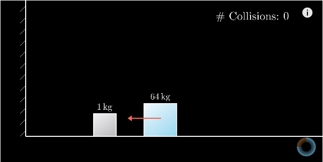
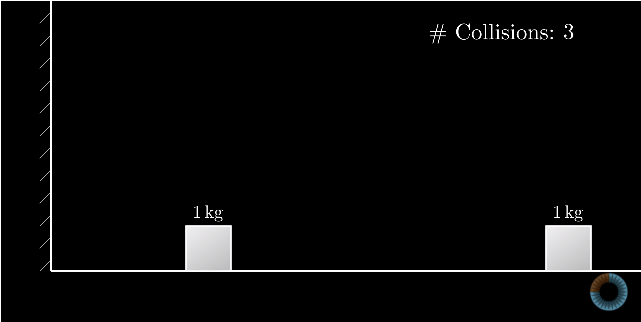
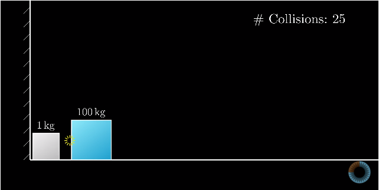
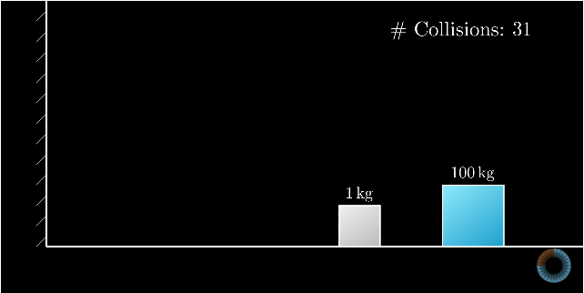

# Pool_Pi
The number of collisions between two objects equals a number of digits of Pi 

## From where I got this
I called this sketch Pool_pi because the original paper about this (written in 2003) was called something like Pi in Pool. I learned about this from a recent 3Blue1Brown series:

1st video: https://www.youtube.com/watch?v=HEfHFsfGXjs   
2nd video: https://www.youtube.com/watch?v=jsYwFizhncE   
3rd video: https://www.youtube.com/watch?v=brU5yLm9DZM

## The idea
The idea is 2 blocks on a frictionless surface. One slides towards the other, that is facing a wall. All collisions are perfectly elastic.

If the two blocks have the same mass, you can quickly calculate that there will be 3 collisions.

If the one block is 100x the other, it just so happens that there will be 31 collisions.

If the one block is 10000x the other, there will be 314 collisions (I get tired of making graphics).  
If the one block is 1000000x the other, there will be 3141 collisions.

That's pi!

## The issue!

In my own code, I first used Box2D.  
It worked for mass ratios of 1 and 100, but it didn't work for 10000.

Then I started writing my own physics engine, hoping to fix this issue. But it was even worse.  
I couldn't even get 100 to work.

Then I figured that the blocks are colliding too frequently. So I slowed the 1st block down.  
I could get 100 to work this way, but not 10000.

Can anybody help to fix this issue?

Here is a link to the video I made about my code: https://youtu.be/u8VhOUYVy80  
I borrowed part of the code from here: https://processing.org/examples/circlecollision.html
